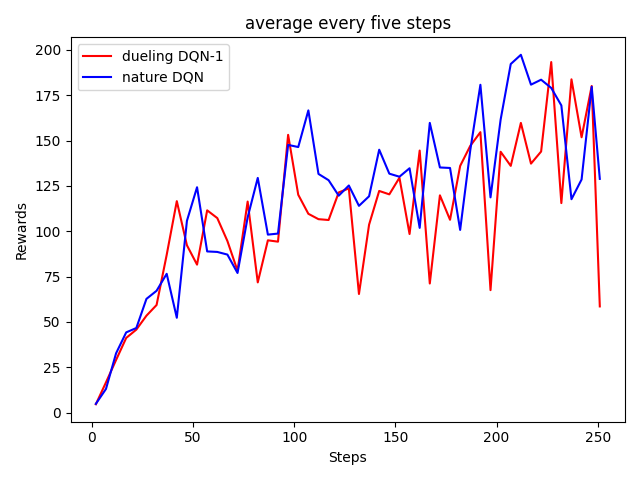
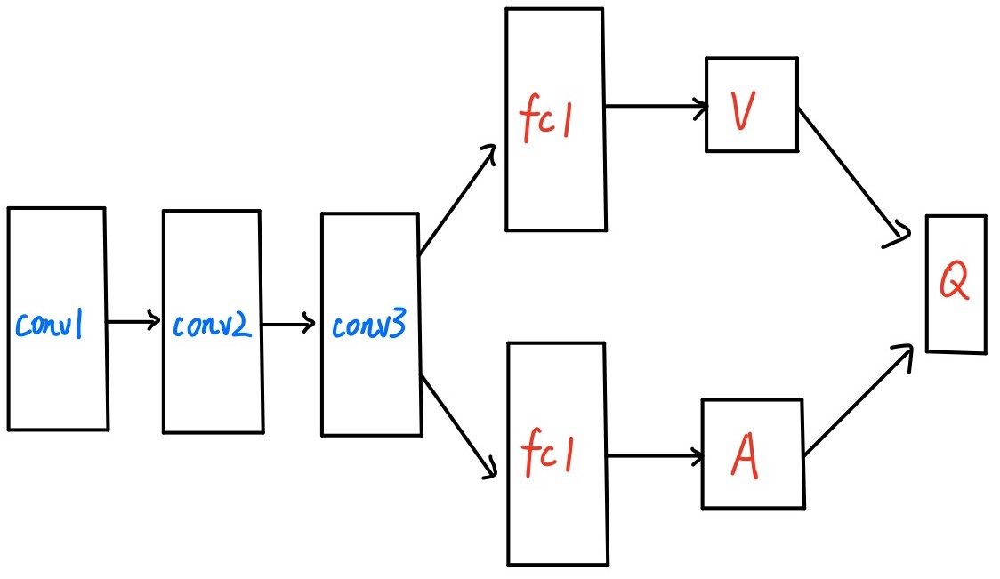

- # Mid-term **Assignments——DQN**

  ##  Code reading 

  ### utils_types.py

  > Any is a special type. Static type checkers treat all types as if they are compatible with Any, and vice versa, and Any is compatible with all types. 
  >
  > The meaning of the various variables is explained in the code comments.

  ### utils_memory.py

  > Used to preserve previous experiences for learning.
  >
  > The way to learn is to extract fragments of saved experience (the value given in the original code is 32) from which to derive the next action that will get the most benefit in the current state. 

  ### utils_env.py

  > Design a structure `MyEnv` for interaction between DQN algorithm decisions and the game atari-breakout. 
  >
  > This module is the key for the DQN algorithm to interact with the game atari-Breakout.

  ### utils_model.py

  > This section of code defines the concrete framework for reinforcement learning networks. In the initial code, three  convolution layer  and two full connection layers are designed. 
  >
  > At the same time, the forward function is defined, whose function is to define the processing mode of the input data to calculate the required model output each time the neural network is called.

  ### utils_drl.py

  > This module mainly defines a structure `Agent` as the carrier for the algorithm to run.
  >
  > The structure contains four functions: `run(),learn(),sync(),save()`.
  >
  > **run():**  Perform the next action in the current state. The details are as follows: get a random number, if it is greater than the given **__eps** value, perform the optimal action from target network, or perform an action at random. 
  >
  > **learn():** Calculate the current Q value and the target Q value.  Update the parameters in the Q network by using the loss function(`F.smooth_l1_loss`) through gradient back propagation of the neural network.
  >
  > **sync():**  Updates the Q value of the policy network to the target network.
  >
  > **save(): **Save the state dict of the policy network.

  

  ##  Algorithm flow

  I will parse the entire algorithm starts with the **main.py**. 

  When the number of running steps is less than WARM_STEPS, the algorithm is simply sampling the interaction with the environment without learning. 

  If larger than `WARM_STEPS`, the algorithm will learn from random sampling from `memory` every `POLICY_UPDATE`, and synchronize the current network Q value to the target network every `TARGET_UPDATE`. What's more, the algorithm will write the average every `EVALUATE_FREQ` into **rewards.txt** and generate the model to save in **models**.

  

  ## Dueling DQN-1

  The code framework presented is Nature DQN,  so I will implement Dueling DQN on this basis. 

  The most significant change is in the **utils_model.py**

  ```python
  import torch
  import torch.nn as nn
  import torch.nn.functional as F
  
  
  class DQN(nn.Module):
  
      def __init__(self, action_dim, device):
          super(DQN, self).__init__()
          self.__conv1 = nn.Conv2d(4, 32, kernel_size=8, stride=4, bias=False)
          self.__conv2 = nn.Conv2d(32, 64, kernel_size=4, stride=2, bias=False)
          self.__conv3 = nn.Conv2d(64, 64, kernel_size=3, stride=1, bias=False)
          self.__fc1 = nn.Linear(64*7*7, 512)
          self.__fc2 = nn.Linear(512, action_dim)		# A
          self.__fc3 = nn.Linear(512, 1)				# V
          self.__device = device
  
      def forward(self, x):
          x = x / 255.
          x = F.relu(self.__conv1(x))
          x = F.relu(self.__conv2(x))
          x = F.relu(self.__conv3(x))
          x = F.relu(self.__fc1(x.view(x.size(0), -1)))
          fc2 = self.__fc2(x)							# A
          fc3 = self.__fc3(x)							# V
          
          # Q, Centralize the value of A
          return fc3 + fc2 - torch.mean(fc2,dim=1,keepdim=True)	
  
      @staticmethod
      def init_weights(module):
          if isinstance(module, nn.Linear):
              torch.nn.init.kaiming_normal_(module.weight, nonlinearity="relu")
              module.bias.data.fill_(0.0)
          elif isinstance(module, nn.Conv2d):
              torch.nn.init.kaiming_normal_(module.weight, nonlinearity="relu")
  ```

   The model looks like this: 
   

  The results are as follows(just  25 million steps and every ten million steps make an average merge into one step):

  

  In order to better distinguish the difference between the two, the data is smoothed by the summation average as follow:

  

  

  It is obvious that dueling DQN designed in this way is negatively optimized for the original Nature DQN.

  Reason: **Overestimate**

  Therefore, we consider another Dueling DQN model.

  ## Dueling DQN-2

   The code is as follows: 

  ```python
  import torch
  import torch.nn as nn
  import torch.nn.functional as F
  
  
  class DQN(nn.Module):
  
      def __init__(self, action_dim, device):
          super(DQN, self).__init__()
          self.__conv1 = nn.Conv2d(4, 32, kernel_size=8, stride=4, bias=False)
          self.__conv2 = nn.Conv2d(32, 64, kernel_size=4, stride=2, bias=False)
          self.__conv3 = nn.Conv2d(64, 64, kernel_size=3, stride=1, bias=False)
          self.__fc1 = nn.Linear(64*7*7, 512)
          self.__fc11 = nn.Linear(64*7*7, 512)		# new
          self.__fc2 = nn.Linear(512, action_dim)
          self.__fc3 = nn.Linear(512, 1)
          self.__device = device
  
      def forward(self, x):
          x = x / 255.
          x = F.relu(self.__conv1(x))
          x = F.relu(self.__conv2(x))
          x = F.relu(self.__conv3(x))
          y = x
          x = F.relu(self.__fc1(x.view(x.size(0), -1)))
          y = F.relu(self.__fc11(y.view(y.size(0), -1)))	# new
          fc2 = self.__fc2(x)
          fc3 = self.__fc3(y)
          return fc3 + fc2 - torch.mean(fc2,dim=1,keepdim=True)
  
      @staticmethod
      def init_weights(module):
          if isinstance(module, nn.Linear):
              torch.nn.init.kaiming_normal_(module.weight, nonlinearity="relu")
              module.bias.data.fill_(0.0)
          elif isinstance(module, nn.Conv2d):
              torch.nn.init.kaiming_normal_(module.weight, nonlinearity="relu")
  
  ```

  Agent, I also use conceptual model diagram to explain the code:

  

  In the actual situation, the action with the maximum Q value is **not** selected every time in a given state, because the real strategy is generally **random**, so here the target value directly chooses the Q value of the action with the maximum Q value tends to make the target value higher than the real value, thus leading to the decline of learning effect. 

  In order to solve this problem,  I made the **arguments** passed into the **value function** and **advantage function** more **random** and **independent**.

  This is obviously very effective, and the results are as follows:

  

  

  

  ## Training effect video presentation 

  ### Dueling DQN-1

  https://www.hz-heze.com/wp-content/uploads/2020/11/dueling-1.mp4

  ### Dueling DQN-2

  https://www.hz-heze.com/wp-content/uploads/2020/11/dueling-2.mp4

  ##      **Authorship**  

  | Member | Ideas | Coding | Writing |
  | ------ | ----- | ------ | ------- |
  | 郭庭浩 | 100%  | 100%   | 100%    |

  
